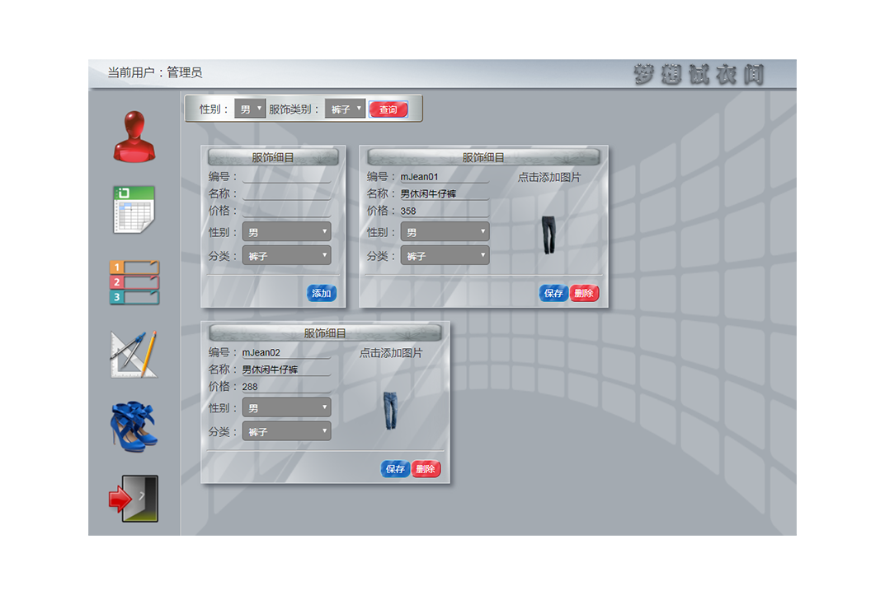

### DreamFittingRoom

###### major technology

- RestEasy framework
- JPA
- JQuery and Ajax

###### development process

1. completing the login and register function.

2. completing the management of user infomation,power control and clothing management.

3. completing the the picture of clothing upload.

4. completing the the virtual dressing UI and logout funtion.

---

###### 部分效果展示

   

